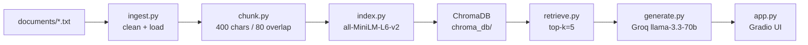

# Project 1 Planning: The Unofficial Guide

## Domain

Unofficial student knowledge for CS 482 Applied Algorithms — exam experiences, professor reviews, project autograder tips, and exam recaps that official syllabi don't capture well. Official course pages describe policies at a high level, but students need concrete advice like how DP questions are graded, whether attendance matters, and which algorithm mistakes cost the most points on past exams.
---

## Documents

| # | Source | Description | URL or location |
|---|--------|-------------|-----------------|
| 1 | Reddit-style | Midterm debrief — graph/DP weight, complexity required | documents/reddit_exam_01.txt |
| 2 | Reddit-style | Final exam predictions — cumulative scope, knapsack/Bellman-Ford | documents/reddit_exam_02.txt |
| 3 | Reddit-style | How to study for DP — state definition, office hours | documents/reddit_exam_03.txt |
| 4 | Reddit-style | Partial credit — recurrence reasoning earns points even if answer is wrong | documents/reddit_exam_04.txt |
| 5 | Reddit-style | Is this class curved? — no fixed curve, Fall 2024 midterm avg 74% | documents/reddit_exam_05.txt |
| 6 | Reddit-style | Dijkstra vs Bellman-Ford — negative-edge trap on exams | documents/reddit_exam_06.txt |
| 7 | Reddit-style | Attendance not graded, but lecture examples appear on exams | documents/reddit_exam_07.txt |
| 8 | Reddit-style | Homework vs exam difficulty — exams more proof-heavy | documents/reddit_exam_08.txt |
| 9 | Reddit-style | Midterm time management — 75 minutes, 5 questions | documents/reddit_exam_09.txt |
| 10 | Reddit-style | TA review session — matrix chain multiplication, edit distance | documents/reddit_exam_10.txt |
| 11 | Reddit-style | Graph traversal confusion — BFS vs Dijkstra, O(V+E) justification | documents/reddit_exam_11.txt |
| 12 | Reddit-style | Exam format — closed book, one handwritten cheat sheet allowed | documents/reddit_exam_12.txt |
| 13 | Reddit-style | Retake advice — redo homework, optional redo problem set | documents/reddit_exam_13.txt |
| 14 | Reddit-style | Greedy vs DP trap — modified activity selection needs DP | documents/reddit_exam_14.txt |
| 15 | Reddit-style | Office hours tip — bring wrong answers for feedback | documents/reddit_exam_15.txt |
| 16 | RateMyProfessors-style | Dr. Chen review — tricky exams, partial credit, lecture examples (4.5/5) | documents/rmp_review_01.txt |
| 17 | RateMyProfessors-style | Dr. Chen review — clear lectures, closed book, cheat sheet allowed (4/5) | documents/rmp_review_02.txt |
| 18 | RateMyProfessors-style | Dr. Chen review — weekly homework, midterm avg low 70s, complexity required (3.5/5) | documents/rmp_review_03.txt |
| 19 | RateMyProfessors-style | Dr. Chen review — best DP explanation, final fair, all from lectures (5/5) | documents/rmp_review_04.txt |
| 20 | RateMyProfessors-style | Dr. Chen review — graph unit, negative-edge exam warning (4/5) | documents/rmp_review_05.txt |
| 21 | RateMyProfessors-style | Dr. Chen review — strict autograder, start search agent early (3/5) | documents/rmp_review_06.txt |
| 22 | RateMyProfessors-style | Dr. Chen review — DP grading emphasizes state and recurrence (4.5/5) | documents/rmp_review_07.txt |
| 23 | RateMyProfessors-style | Dr. Chen review — syllabus accurate, exam questions mirror lecture twists (4/5) | documents/rmp_review_08.txt |
| 24 | RateMyProfessors-style | Dr. Chen review — not an easy A, review sessions explain common mistakes (3.5/5) | documents/rmp_review_09.txt |
| 25 | RateMyProfessors-style | Dr. Chen review — search agent 25% of grade, BFS/A* output must match (4/5) | documents/rmp_review_10.txt |
| 26 | Student forum | AI Search Agent — strict autograder, don't rename skeleton methods | documents/project_discussion_01.txt |
| 27 | Student forum | AI Search Agent — A* heuristic pitfalls, tie-breaking, late penalty | documents/project_discussion_02.txt |
| 28 | Student forum | AI Search Agent — hidden large mazes, queue/priority queue requirements | documents/project_discussion_03.txt |
| 29 | Student forum | AI Search Agent — optional partners, code similarity checker | documents/project_discussion_04.txt |
| 30 | Student forum | AI Search Agent — BFS visited-node bugs, path reconstruction | documents/project_discussion_05.txt |
| 31 | Student forum | AI Search Agent — bring failing autograder test name to office hours | documents/project_discussion_06.txt |
| 32 | Student forum | AI Search Agent — A* admissibility, rubric breakdown | documents/project_discussion_07.txt |
| 33 | Student forum | AI Search Agent — no external libraries, submit .py not notebook | documents/project_discussion_08.txt |
| 34 | Student forum | AI Search Agent — BFS milestone week 8, incremental grading | documents/project_discussion_09.txt |
| 35 | Student forum | AI Search Agent — README required, 10-point penalty if missing | documents/project_discussion_10.txt |
| 36 | Exam recap | Fall 2024 midterm — graph/DP topics, avg 74%, greedy-vs-DP mistake | documents/exam_recap_midterm_fall24.txt |
| 37 | Exam recap | Fall 2024 final — Bellman-Ford, matrix chain, 3D DP state | documents/exam_recap_final_fall24.txt |
| 38 | Exam recap | Spring 2025 midterm — BFS modeling, Dijkstra on unweighted graphs mistake | documents/exam_recap_midterm_spring25.txt |
| 39 | Exam recap | Quiz 1 Fall 2024 — asymptotic notation, Master theorem | documents/exam_recap_quiz1_fall24.txt |
| 40 | Exam recap | Fall 2023 midterm archive — LIS DP, complexity justification errors | documents/exam_recap_midterm_fall23.txt |
| 41 | Exam recap | Spring 2025 final review — cumulative topics, greedy proof predictions | documents/exam_recap_final_spring25.txt |
| 42 | Exam recap | DP focus sheet — state, recurrence, base cases, common deductions | documents/exam_recap_dp_focus.txt |
| 43 | Exam recap | Graph focus sheet — BFS, Dijkstra, Bellman-Ford selection guide | documents/exam_recap_graph_focus.txt |
| 44 | Exam recap | Complexity focus — Big-O pitfalls, adjacency list vs matrix | documents/exam_recap_complexity.txt |
| 45 | Exam recap | Greedy vs DP — when greedy fails, counterexample requirement | documents/exam_recap_greedy_vs_dp.txt |
| 46 | Official | Syllabus excerpt — grading weights, exam policies, learning outcomes | documents/official_syllabus_excerpt.txt |
| 47 | Official | Project handout — AI Search Agent requirements, submission format | documents/official_project_handout.txt |
| 48 | Official | Exam policy — pseudocode, correctness, complexity required on all answers | documents/official_exam_policy.txt |
| 49 | Official | DP grading rubric — 15-point breakdown by component | documents/official_dp_grading_rubric.txt |
| 50 | Official | Office hours — instructor and TA schedule, no exam previews | documents/official_office_hours.txt |

---

## Chunking Strategy

**Chunk size:** 400 characters

**Overlap:** 80 characters

**Reasoning:**
- Corpus is uniformly short (~280–540 chars/file; avg ~380) — mostly Reddit posts, RMP reviews, forum threads, exam recaps.
- Most of files fit in one 400-char chunk; each file already covers one topic.
- **Fixed-size + overlap:** simple, predictable; 80-char overlap handles the ~18 longer files without splitting paired facts (e.g., recurrence + partial credit).
- **Not recursive:** built for long PDFs/web pages — would return whole files here with extra complexity.
- **Not paragraph/semantic:** headers (`Source:`, `Course:`) would split from body text on blank-line breaks.
- **Not hybrid:** only worth it when mixing very long + very short docs; our production data will stay in this same short-post format.

---

## Retrieval Approach

**Embedding model:** all-MiniLM-L6-v2 (sentence-transformers, local)

**Top-k:** 5

**Why this model:**
- Runs locally — no API key, no rate limits, fits project free stack.
- Strong enough for short student posts where queries and chunks share similar wording.
- Fast to embed ~50–70 chunks; good default for a  RAG pipeline.

**Why top-k = 5:**
- Our chunks are small — 5 chunks ≈ 5 files worth of context, enough for multi-source answers (e.g., rubric + Reddit + RMP).
- k=3 risks missing a key source; k=8+ adds noise from overlapping duplicate facts across files.

**Production tradeoff reflection:**
- **Accuracy:** upgrade to e5-large or domain-fine-tuned models for better match on CS terms ("Bellman-Ford" vs "Dijkstra", "recurrence" vs "runtime").
- **Multilingual:** use multilingual embeddings if corpus includes non-English forum posts.
- **Latency/cost:** hosted APIs (OpenAI, Cohere) scale better at volume; local models win on privacy and zero marginal cost.
- **Context length:** larger models matter more for long PDFs; less critical for our short-post corpus.

---

## Evaluation Plan

| # | Question | Expected answer |
|---|----------|-----------------|
| 1 | How does the professor grade dynamic programming questions? | Expect state definition, recurrence, base cases, correctness explanation, and complexity analysis; students lose points for skipping recurrence justification; partial credit for reasoning even if final answer is wrong. |
| 2 | Can I use Dijkstra's algorithm when the graph has negative edge weights? | No — use Bellman-Ford; using Dijkstra on negative edges is a common exam mistake worth significant point loss. |
| 3 | What are the rules for the AI Search Agent project autograder? | Do not rename methods or change function signatures; BFS and A* must match expected output exactly; helper functions allowed; submit search.py + README.zip. |
| 4 | Is attendance graded in CS 482? | No — attendance is not graded, but lecture examples often appear on exams. |
| 5 | What was the Fall 2024 midterm average score? | 74% |

---

## Anticipated Challenges

1. **Overlapping facts across sources** — DP grading appears in Reddit posts, RMP reviews, official rubric, and exam recaps; retrieval may return redundant chunks or miss the official rubric if the query is vague.

2. **Short document fragmentation** — Some RMP reviews are under 400 chars; chunking may produce single-chunk docs where overlap doesn't help, but very specific queries might still match weakly if wording differs (e.g., "grade DP" vs "dynamic programming rubric").

---

## Architecture

---

## AI Tool Plan

**Milestone 3 — Ingestion and chunking:**
- Tool: Cursor/Claude
- Input: Documents table + Chunking Strategy + Architecture diagram from this file
- Output: `src/ingest.py`, `src/chunk.py`, `build_index.py`
- Verify: run `python build_index.py`, inspect 5 printed chunks for HTML junk and fragments

**Milestone 4 — Embedding and retrieval:**
- Tool: Cursor/Claude
- Input: Retrieval Approach section + Architecture diagram
- Output: `src/index.py`, `src/retrieve.py`, `test_retrieval.py`
- Verify: run `python test_retrieval.py`, confirm top chunks match eval questions and distances < 0.5

**Milestone 5 — Generation and interface:**
- Tool: Cursor/Claude
- Input: Grounding requirements + Groq stack from project instructions
- Output: `src/generate.py`, `src/query.py`, `app.py`
- Verify: ask 3 eval questions in Gradio, confirm source filenames appear; ask out-of-scope question and confirm refusal
